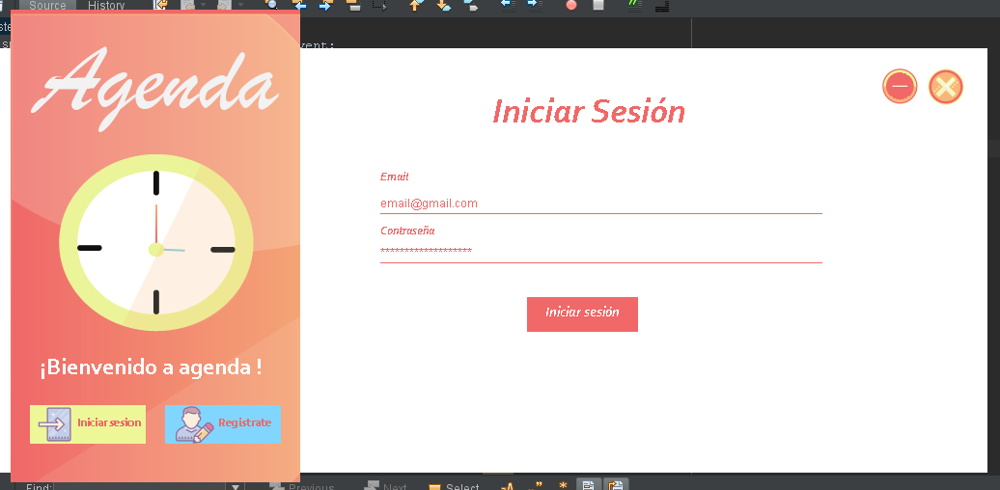
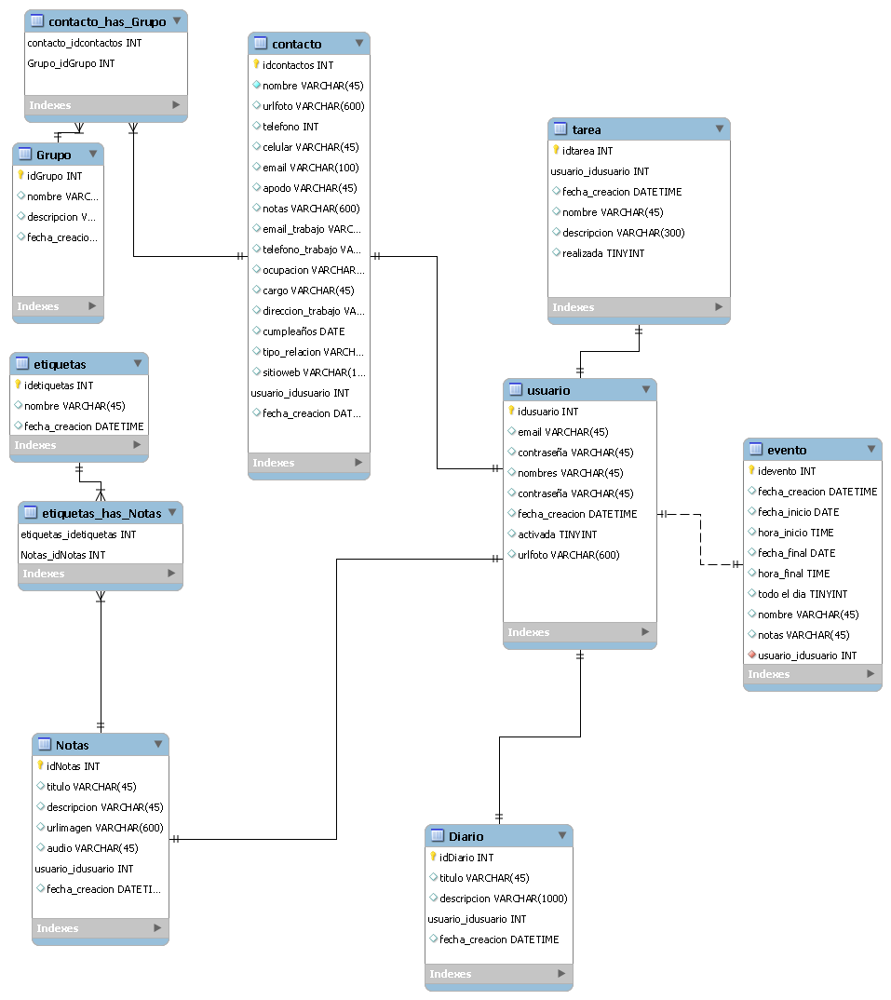
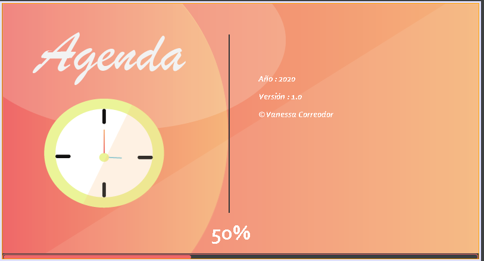
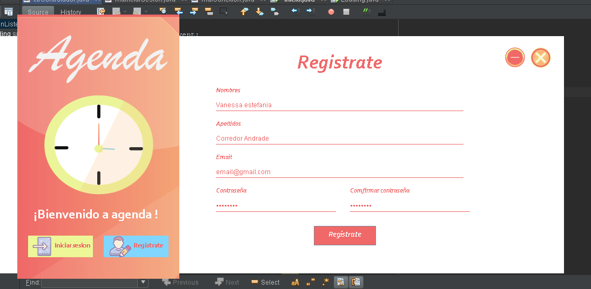

# Agenda java swing

 Aplicación de escritorio desarrolalda con **Java** y la base de datos **Mysql** , en la cual puedes
añadir contactos , eventos ,tareas y escribir tu propio diario . 

# Caracteristicas

- Base de datos mysql
- Animación slider
- Lenguaje Mysql
- Arquitectura MVC
- Loanding

# Requerimientos
- Java
- Mysql

# Diseño de base de datos

# Uso

- Crea una base de datos llamada agenda_avanzada
- Importa las tablas del archivo agenda_avanzada.sql ubicado en la carpeta *Base de datos¨*
- Si te aparece algun error de que no encuentra las librerias ,estas estan en la carpeta *Librerias*

# Capturas
##  Loading

## Login  

## Registro

